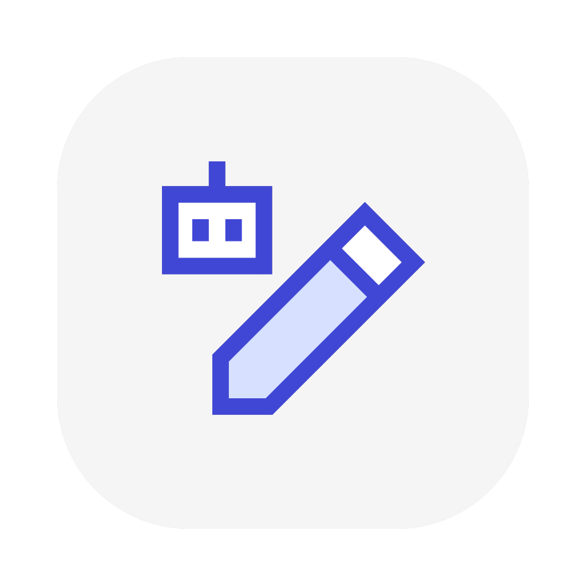

<div style="
   display: flex;
   justify-content: center;
   align-items: center;
   flex-direction: row;
">
   
   <h1>LMCanvas</h1>
</div>

UI generated by LLM, Interact with LLM

基于大模型的UI动态生成，UI与大模型交互

This is a prototype, there are many imperfections.

这只是一个原型，还有很多不完善的地方

# 与众不同之处 / Unique Features

相对于Code Preview(Gemini的Canvas、Claude的Artifacts)，它不再是单次生成单次预览，而是继承式的补充；它不是用户分别与模型和预览交互，而是在用户与界面交互时界面与模型交互

Compared with Code Preview(Gemini's Cnavas/Claude's Artifacts), it is not a one-time generation and preview, but an incremental supplement; it is not that the user interacts with the model and preview separately, but that the interface interacts with the model when the user interacts with the interface.

## 功能特性 / Features

- 由LLM实时生成代码(兼容OpenAI API)
- Codes generated by LLM instantly(compatible with OpenAI API)
- 通过[asak](https://github.com/for-the-zero/asak)混用模型，避免触发速率限制
- Mix models using [asak](https://github.com/for-the-zero/asak), avoiding rate limiting
- 基于Fluent UI React Components构建的美观控制台界面
- Fluent UI React Components-based beautiful console interface
- 代码高亮和Markdown支持
- Code highlighting and Markdown support

## 安装 / Installation

### 直接使用 / Direct Use

前往[Releases页面](https://github.com/for-the-zero/LMCanvas/releases)下载Windows版本安装包

Go to the [Releases page](https://github.com/for-the-zero/LMCanvas/releases) to download the Windows installation package.

### 通过源代码构建 / Build from Source

下载安装node.js：[官网](https://nodejs.org/zh-cn/download)

1. Download and install node.js: [official website](https://nodejs.org/en/download)

2. 克隆仓库 / Clone the repository
   
   ```bash
   git clone git@github.com:for-the-zero/LMCanvas.git
   ```

3. 安装依赖 / Install dependencies
   
   ```bash
   npm install --verbose
   ```

4. 构建 / Build
   
   ```bash
   npm run build
   ```

5. 启动 / Start
   
   构建产物在builds文件夹内
   
   The build product is in the builds folder.

## AI能做到的 / What AI can do

- 生成页面
- Generate a pages
- 通过`send2ai`函数实现界面与LLM交互
- Implement interface interaction with LLM through the `send2ai` function
- 使用node的`fs` `path`模块和electron的`clipboard` `fetch` `shell`模块
- Use the `fs` `path` module and `clipboard` `fetch` `shell` modules of node and electron respectively

## 系统提示词 / System prompts

由Gemini 2.5 Pro根据[Prompt 101](https://services.google.com/fh/files/misc/gemini-for-google-workspace-prompting-guide-101.pdf)

Generated by Gemini 2.5 Pro based on [Prompt 101](https://services.google.com/fh/files/misc/gemini-for-google-workspace-prompting-guide-101.pdf)

## 相关链接 / Links

- [GitHub仓库 / GitHub Repository](https://github.com/for-the-zero/LMCanvas)
- [免费LLM API集合 / Free LLM Collection](https://github.com/for-the-zero/Free-LLM-Collection)
- [asak](https://github.com/for-the-zero/asak)
- [Fluent UI React Components](https://react.fluentui.dev/)

# 图标 / Icon

Generated by [AppIcon Forge](https://zhangyu1818.github.io/appicon-forge/)

Author: [Streamline](https://github.com/webalys-hq/streamline-vectors)

Licence: [CC BY 4.0](https://creativecommons.org/licenses/by/4.0/)
